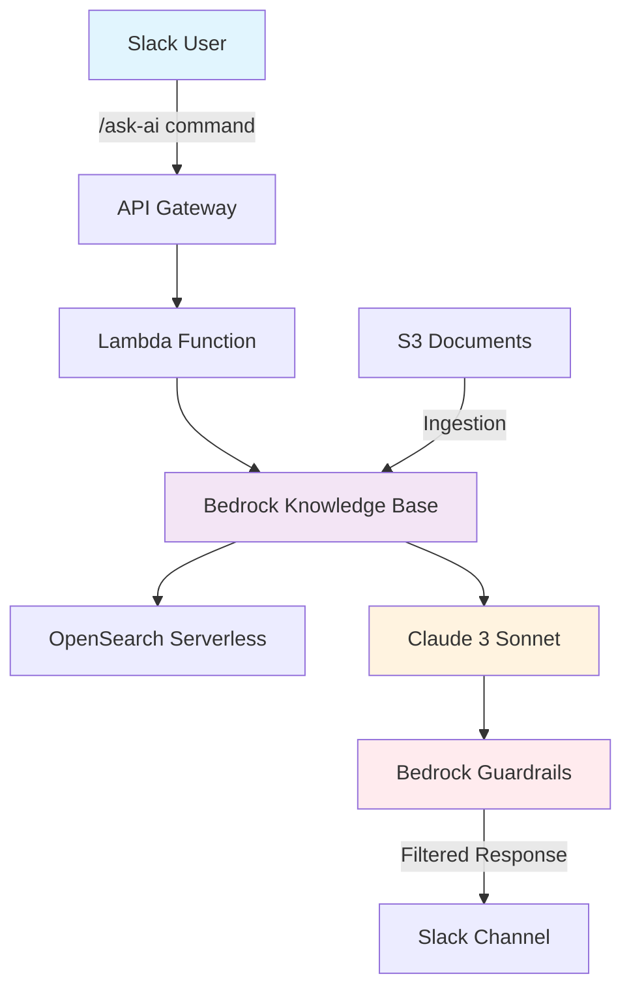
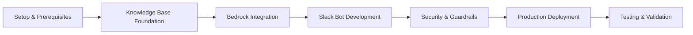

#### Introduction to Slackbot Assistant with Amazon Bedrock

Welcome to this comprehensive workshop on building a Generative AI Slack Assistant with Amazon Bedrock Knowledge Bases! In this hands-on experience, you'll learn to create an intelligent AI assistant that transforms how your organization accesses and utilizes knowledge, making information instantly available through natural language conversations in Slack.

#### The Challenge We're Addressing

Modern organizations face a critical productivity challenge: **information silos**. Valuable knowledge is scattered across documents, wikis, policies, and databases, making it difficult for employees to find answers quickly. Traditional search methods often fail to understand context and intent, leading to:

- **Time waste** searching through multiple documents
- **Inconsistent answers** from different team members
- **Knowledge gaps** when experts are unavailable
- **Reduced productivity** due to information friction

#### Our Solution Approach

This workshop demonstrates how to transform static organizational knowledge into an intelligent, conversational assistant that integrates seamlessly with existing workflows through Slack.

#### Workshop Objectives

By completing this workshop, you will achieve the following learning outcomes:

#### Primary Objectives

1. **Master RAG Architecture**

   - Understand Retrieval-Augmented Generation principles
   - Implement vector-based semantic search
   - Design efficient document ingestion pipelines

2. **Build Production-Ready AI Systems**

   - Deploy scalable serverless architecture
   - Implement proper error handling and monitoring
   - Configure auto-scaling and cost optimization

3. **Integrate Security**

   - Configure Amazon Bedrock Guardrails
   - Implement PII detection and anonymization
   - Set up content filtering and safety measures

4. **Develop Slack Bot Applications**
   - Use Slack Bolt framework for Python
   - Handle asynchronous message processing
   - Implement proper authentication and permissions

#### Technical Skills You'll Gain

- **Amazon Bedrock** integration and model management
- **OpenSearch Serverless** vector database operations
- **AWS Lambda** serverless function development
- **API Gateway** REST API configuration
- **Infrastructure as Code** using AWS CDK
- **Slack API** development and webhook handling

#### SlackBot Architecture

#### Architecture Flow Diagram

#### Key Components Explained

| Component                  | Purpose                      | Benefits                                 |
| -------------------------- | ---------------------------- | ---------------------------------------- |
| **Slack Interface**        | User interaction layer       | Familiar interface, no training required |
| **API Gateway**            | HTTP endpoint management     | Secure, scalable API access              |
| **Lambda Function**        | Business logic processing    | Serverless, cost-effective compute       |
| **Bedrock Knowledge Base** | RAG orchestration            | Fully managed, no infrastructure         |
| **OpenSearch Serverless**  | Vector storage and search    | Auto-scaling, semantic search            |
| **Bedrock Guardrails**     | Content safety and filtering | Enterprise-grade security                |

#### What You'll Build

**1. Intelligent Slack Assistant**

- **Natural Language Processing**: Ask questions in plain English
- **Contextual Responses**: AI-powered answers with source citations
- **Multi-Document Search**: Query across your entire knowledge base
- **Real-Time Processing**: Sub-3-second response acknowledgment

**2. Enterprise Security Features**

- **Content Filtering**: Block inappropriate or harmful content
- **PII Protection**: Automatic detection and anonymization
- **Prompt Injection Defense**: Prevent malicious prompt manipulation
- **Access Control**: Workspace-based permissions

**3. Production-Ready Infrastructure**

- **Auto-Scaling**: Handle varying workloads automatically
- **Monitoring**: CloudWatch integration for observability
- **Error Handling**: Graceful degradation and user feedback
- **Cost Optimization**: Pay-per-use serverless model

#### Real-World Applications

This solution pattern enables numerous enterprise use cases:

**1. Customer Support**

- Instant answers from product documentation
- Consistent responses across support teams
- Reduced ticket volume and response times

**2. Human Resources**

- Employee self-service for policy questions
- Onboarding assistance and training materials
- Benefits and procedure clarification

**3. Technical Documentation**

- Engineering knowledge base access
- API documentation and troubleshooting guides
- Best practices and coding standards

**4. Compliance & Legal**

- Regulatory requirement queries
- Policy interpretation and guidance
- Audit preparation and documentation

#### Technology Stack Deep Dive

**1. Amazon Bedrock Ecosystem**

- **Foundation Models**: Claude 3 Sonnet for text generation
- **Embeddings**: Titan Text Embeddings V2 for vector creation
- **Knowledge Bases**: Managed RAG workflow orchestration
- **Guardrails**: Content safety and filtering mechanisms

**2. Supporting AWS Services**

- **Lambda**: Event-driven serverless compute
- **API Gateway**: RESTful API management
- **S3**: Document storage and versioning
- **OpenSearch Serverless**: Vector database operations
- **CloudWatch**: Logging, monitoring, and alerting
- **Secrets Manager**: Secure credential storage

**3. Development Framework**

- **Slack Bolt for Python**: Simplified bot development
- **AWS CDK**: Infrastructure as Code deployment
- **Python 3.12+**: Modern language features and performance

#### Workshop Learning Path

#### Success Metrics

Upon workshop completion, you'll have achieved:

**1. Functional Deliverables**

- Working Slack bot responding to natural language queries
- Deployed AWS infrastructure with proper security
- Integrated knowledge base with your documents
- Monitoring and alerting configuration

**2. Measurable Outcomes**

- **Response Time**: < 3 seconds for query acknowledgment
- **Accuracy**: Relevant answers with source attribution
- **Security**: Zero inappropriate content in responses
- **Scalability**: Handle 100+ concurrent users

**3. Knowledge Transfer**

- Understanding of RAG architecture principles
- Hands-on experience with Amazon Bedrock services
- Production deployment best practices
- Enterprise AI security implementation

#### Next Steps

Now that you understand the workshop objectives and architecture, you're ready to begin the hands-on implementation. The journey ahead will transform you from an AI curious professional to someone capable of deploying production-grade generative AI solutions.

**Let's start building the future of workplace productivity!**

---

**Continue to**: [Environment Setup](../2-environment-setup/)
