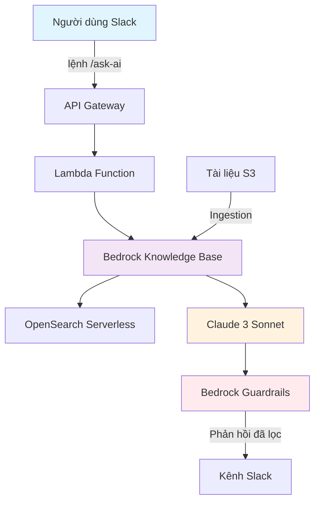
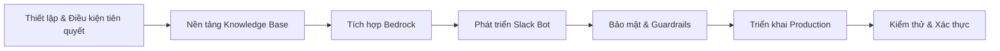

#### Giới thiệu về Trợ lý Slackbot với Amazon Bedrock

Chào mừng bạn đến với workshop toàn diện về xây dựng Trợ lý Slack AI Tạo sinh với Amazon Bedrock Knowledge Bases! Trong trải nghiệm thực hành này, bạn sẽ học cách tạo ra một trợ lý AI thông minh giúp biến đổi cách tổ chức của bạn truy cập và sử dụng kiến thức, làm cho thông tin có thể truy cập ngay lập tức thông qua các cuộc trò chuyện bằng ngôn ngữ tự nhiên trong Slack.

#### Thách thức chúng ta đang giải quyết

Các tổ chức hiện đại đối mặt với một thách thức năng suất quan trọng: **các silo thông tin**. Kiến thức có giá trị bị phân tán trên các tài liệu, wiki, chính sách và cơ sở dữ liệu, khiến nhân viên khó tìm được câu trả lời nhanh chóng. Các phương pháp tìm kiếm truyền thống thường không hiểu được ngữ cảnh và ý định, dẫn đến:

- **Lãng phí thời gian** tìm kiếm qua nhiều tài liệu
- **Câu trả lời không nhất quán** từ các thành viên khác nhau trong nhóm
- **Khoảng trống kiến thức** khi các chuyên gia không có mặt
- **Giảm năng suất** do ma sát thông tin

#### Phương pháp giải pháp của chúng ta

Workshop này trình bày cách biến đổi kiến thức tổ chức tĩnh thành một trợ lý thông minh, có thể trò chuyện tích hợp liền mạch với quy trình làm việc hiện có thông qua Slack.

#### Mục tiêu Workshop

Bằng cách hoàn thành workshop này, bạn sẽ đạt được các kết quả học tập sau:

#### Mục tiêu chính

1. **Thành thạo Kiến trúc RAG**

   - Hiểu các nguyên tắc Retrieval-Augmented Generation
   - Triển khai tìm kiếm ngữ nghĩa dựa trên vector
   - Thiết kế pipeline ingestion tài liệu hiệu quả

2. **Xây dựng Hệ thống AI sẵn sàng cho Production**

   - Triển khai kiến trúc serverless có thể mở rộng
   - Triển khai xử lý lỗi và giám sát phù hợp
   - Cấu hình auto-scaling và tối ưu hóa chi phí

3. **Tích hợp Bảo mật Doanh nghiệp**

   - Cấu hình Amazon Bedrock Guardrails
   - Triển khai phát hiện và ẩn danh hóa PII
   - Thiết lập lọc nội dung và các biện pháp an toàn

4. **Phát triển Ứng dụng Slack Bot**
   - Sử dụng framework Slack Bolt cho Python
   - Xử lý xử lý tin nhắn bất đồng bộ
   - Triển khai xác thực và quyền phù hợp

#### Kỹ năng Kỹ thuật bạn sẽ có được

- Tích hợp **Amazon Bedrock** và quản lý model
- Các thao tác cơ sở dữ liệu vector **OpenSearch Serverless**
- Phát triển hàm serverless **AWS Lambda**
- Cấu hình REST API **API Gateway**
- **Infrastructure as Code** sử dụng AWS CDK
- Phát triển **Slack API** và xử lý webhook

#### Kiến trúc SlackBot

#### Sơ đồ Luồng Kiến trúc

#### Giải thích các Thành phần Chính

| Thành phần                 | Mục đích                   | Lợi ích                                     |
| -------------------------- | -------------------------- | ------------------------------------------- |
| **Giao diện Slack**        | Lớp tương tác người dùng   | Giao diện quen thuộc, không cần đào tạo     |
| **API Gateway**            | Quản lý endpoint HTTP      | Truy cập API an toàn, có thể mở rộng        |
| **Lambda Function**        | Xử lý logic nghiệp vụ      | Serverless, tính toán hiệu quả chi phí      |
| **Bedrock Knowledge Base** | Điều phối RAG              | Được quản lý hoàn toàn, không cơ sở hạ tầng |
| **OpenSearch Serverless**  | Lưu trữ vector và tìm kiếm | Auto-scaling, tìm kiếm ngữ nghĩa            |
| **Bedrock Guardrails**     | An toàn nội dung và lọc    | Bảo mật cấp doanh nghiệp                    |

#### Những gì bạn sẽ xây dựng

**1. Trợ lý Slack Thông minh**

- **Xử lý Ngôn ngữ Tự nhiên**: Đặt câu hỏi bằng tiếng Anh đơn giản
- **Phản hồi Theo ngữ cảnh**: Câu trả lời được hỗ trợ bởi AI với trích dẫn nguồn
- **Tìm kiếm Đa tài liệu**: Truy vấn trên toàn bộ cơ sở kiến thức của bạn
- **Xử lý Thời gian thực**: Xác nhận phản hồi dưới 3 giây

**2. Tính năng Bảo mật Doanh nghiệp**

- **Lọc Nội dung**: Chặn nội dung không phù hợp hoặc có hại
- **Bảo vệ PII**: Phát hiện và ẩn danh hóa tự động
- **Phòng thủ Prompt Injection**: Ngăn chặn thao tác prompt độc hại
- **Kiểm soát Truy cập**: Quyền dựa trên workspace

**3. Cơ sở hạ tầng Sẵn sàng Production**

- **Auto-Scaling**: Xử lý khối lượng công việc thay đổi tự động
- **Giám sát**: Tích hợp CloudWatch cho khả năng quan sát
- **Xử lý Lỗi**: Degradation nhẹ nhàng và phản hồi người dùng
- **Tối ưu hóa Chi phí**: Mô hình serverless trả theo sử dụng

#### Ứng dụng Thực tế

Mẫu giải pháp này cho phép nhiều trường hợp sử dụng doanh nghiệp:

**1. Hỗ trợ Khách hàng**

- Câu trả lời tức thì từ tài liệu sản phẩm
- Phản hồi nhất quán trên các nhóm hỗ trợ
- Giảm khối lượng ticket và thời gian phản hồi

**2. Nhân sự**

- Tự phục vụ nhân viên cho câu hỏi chính sách
- Hỗ trợ onboarding và tài liệu đào tạo
- Làm rõ quyền lợi và thủ tục

**3. Tài liệu Kỹ thuật**

- Truy cập cơ sở kiến thức kỹ thuật
- Tài liệu API và hướng dẫn khắc phục sự cố
- Thực hành tốt nhất và tiêu chuẩn coding

**4. Tuân thủ & Pháp lý**

- Truy vấn yêu cầu quy định
- Giải thích và hướng dẫn chính sách
- Chuẩn bị kiểm toán và tài liệu

#### Tìm hiểu sâu về Technology Stack

**1. Hệ sinh thái Amazon Bedrock**

- **Foundation Models**: Claude 3 Sonnet cho tạo văn bản
- **Embeddings**: Titan Text Embeddings V2 cho tạo vector
- **Knowledge Bases**: Điều phối workflow RAG được quản lý
- **Guardrails**: Cơ chế an toàn và lọc nội dung

**2. Dịch vụ AWS Hỗ trợ**

- **Lambda**: Tính toán serverless theo sự kiện
- **API Gateway**: Quản lý API RESTful
- **S3**: Lưu trữ và phiên bản tài liệu
- **OpenSearch Serverless**: Thao tác cơ sở dữ liệu vector
- **CloudWatch**: Logging, giám sát và cảnh báo
- **Secrets Manager**: Lưu trữ thông tin đăng nhập an toàn

**3. Framework Phát triển**

- **Slack Bolt for Python**: Phát triển bot đơn giản hóa
- **AWS CDK**: Triển khai Infrastructure as Code
- **Python 3.12+**: Tính năng ngôn ngữ hiện đại và hiệu suất

#### Lộ trình Học tập Workshop

#### Chỉ số Thành công

Sau khi hoàn thành workshop, bạn sẽ đạt được:

**1. Deliverables Chức năng**

- Slack bot hoạt động phản hồi các truy vấn ngôn ngữ tự nhiên
- Cơ sở hạ tầng AWS được triển khai với bảo mật phù hợp
- Knowledge base tích hợp với tài liệu của bạn
- Cấu hình giám sát và cảnh báo

**2. Kết quả Có thể đo lường**

- **Thời gian Phản hồi**: < 3 giây cho xác nhận truy vấn
- **Độ chính xác**: Câu trả lời liên quan với ghi nhận nguồn
- **Bảo mật**: Không có nội dung không phù hợp trong phản hồi
- **Khả năng mở rộng**: Xử lý 100+ người dùng đồng thời

**3. Chuyển giao Kiến thức**

- Hiểu các nguyên tắc kiến trúc RAG
- Kinh nghiệm thực hành với dịch vụ Amazon Bedrock
- Thực hành tốt nhất triển khai production
- Triển khai bảo mật AI doanh nghiệp

#### Các bước tiếp theo

Bây giờ bạn đã hiểu các mục tiêu và kiến trúc của workshop, bạn đã sẵn sàng bắt đầu triển khai thực hành. Hành trình phía trước sẽ biến đổi bạn từ một chuyên gia tò mò về AI thành người có khả năng triển khai các giải pháp AI tạo sinh cấp production.

**Hãy bắt đầu xây dựng tương lai của năng suất nơi làm việc!**

---

**Tiếp tục đến**: [Thiết lập Môi trường](../2-environment-setup/)
