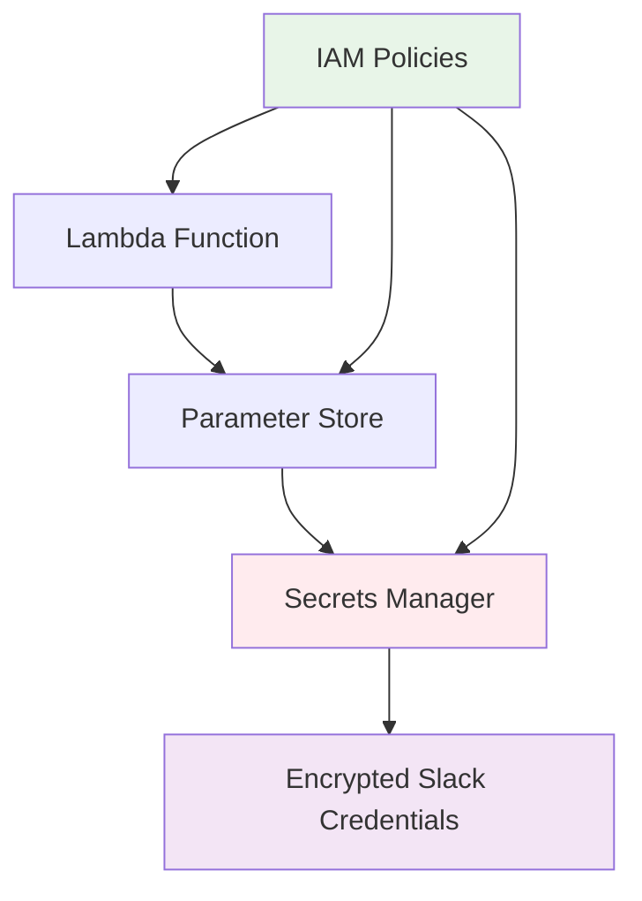

+++
title = "Configure Security"
date = 2024-05-14T00:38:32+07:00
weight = 4
chapter = false
pre = "<b>4. </b>"
+++

#### Security Overview

Security is a foundational element of our AI chatbot system, implemented through a dual-layered approach combining AWS Secrets Manager and AWS Systems Manager Parameter Store for secure credential management throughout the application lifecycle.

#### What You'll Learn

In this module, you will understand:

- **Dual-layer security architecture** using AWS Secrets Manager and Parameter Store
- **Secure credential management** for Slack authentication tokens
- **IAM best practices** for least privilege access
- **Runtime secret resolution** without hardcoded values

#### Security Architecture

**1. Key Components**

| Component               | Purpose                           | Security Benefit                       |
| ----------------------- | --------------------------------- | -------------------------------------- |
| **AWS Secrets Manager** | Store encrypted Slack credentials | Automatic rotation, encryption at rest |
| **Parameter Store**     | Runtime secret resolution         | Dynamic fetching, no hardcoded values  |
| **IAM Policies**        | Access control                    | Least privilege principle              |

**2. Security Flow**

#### Security Benefits

**1. Separation of Concerns**

- **Secrets Manager**: Handles encryption and secure storage
- **Parameter Store**: Manages controlled distribution
- **IAM**: Controls access permissions

**2. Dynamic Resolution**

- Credentials fetched at runtime using `{{resolve:secretsmanager:...}}` syntax
- Always up-to-date values without application restarts
- No hardcoded secrets in source code or environment variables

**3. Audit and Compliance**

- Complete access traceability through CloudTrail
- Compliance-ready logging for security audits
- Monitoring capabilities for unauthorized access attempts

**4. Cost Optimization**

- Standard-tier Parameter Store parameters
- Pay-per-use model with no upfront costs
- No additional encryption charges

#### Implementation Approach

The security implementation follows these principles:

- **Least Privilege Access**: Lambda functions only access required parameters
- **No Direct Secrets Access**: Parameter Store acts as an intermediary layer
- **Encryption at Rest**: All secrets encrypted using AWS-managed keys
- **Runtime Resolution**: Credentials dynamically resolved during execution

#### Expected Outcomes

After implementing this security architecture:

- ✅ Slack credentials securely stored and encrypted
- ✅ Lambda functions access secrets without direct exposure
- ✅ Complete audit trail for compliance requirements
- ✅ Production-ready security posture established

---

**Continue to**: [4.1 - Secret manager](../4-security/4.1-secret%20manager/)
