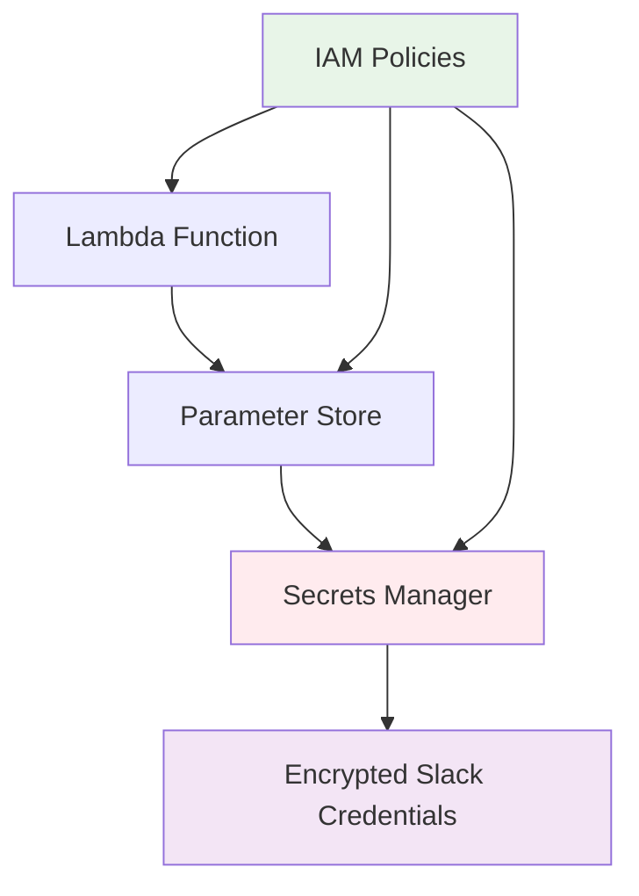

#### Tổng quan Bảo mật

Bảo mật là yếu tố nền tảng của hệ thống AI chatbot, được triển khai thông qua phương pháp hai lớp kết hợp AWS Secrets Manager và AWS Systems Manager Parameter Store để quản lý thông tin đăng nhập an toàn trong suốt vòng đời ứng dụng.

#### Những gì bạn sẽ học

Trong module này, bạn sẽ hiểu:

- **Kiến trúc bảo mật hai lớp** sử dụng AWS Secrets Manager và Parameter Store
- **Quản lý thông tin đăng nhập an toàn** cho Slack authentication tokens
- **IAM best practices** cho quyền truy cập tối thiểu
- **Runtime secret resolution** không có giá trị hardcoded

#### Kiến trúc Bảo mật

**1. Các thành phần chính**

| Thành phần              | Mục đích                         | Lợi ích Bảo mật                           |
| ----------------------- | -------------------------------- | ----------------------------------------- |
| **AWS Secrets Manager** | Lưu trữ Slack credentials mã hóa | Rotation tự động, mã hóa at rest          |
| **Parameter Store**     | Runtime secret resolution        | Fetching động, không có giá trị hardcoded |
| **IAM Policies**        | Kiểm soát truy cập               | Nguyên tắc least privilege                |

**2. Luồng Bảo mật**

#### Lợi ích Bảo mật

**1. Tách biệt Mối quan tâm**

- **Secrets Manager**: Xử lý mã hóa và lưu trữ an toàn
- **Parameter Store**: Quản lý phân phối có kiểm soát
- **IAM**: Kiểm soát quyền truy cập

**2. Dynamic Resolution**

- Credentials được fetch tại runtime sử dụng cú pháp `{{resolve:secretsmanager:...}}`
- Luôn có giá trị cập nhật mà không cần khởi động lại ứng dụng
- Không có secrets hardcoded trong source code hoặc environment variables

**3. Audit và Compliance**

- Truy xuất truy cập hoàn chỉnh thông qua CloudTrail
- Logging sẵn sàng compliance cho security audits
- Khả năng giám sát cho các nỗ lực truy cập trái phép

**4. Tối ưu hóa Chi phí**

- Parameter Store parameters tier tiêu chuẩn
- Mô hình pay-per-use không có chi phí trả trước
- Không có phí mã hóa bổ sung

#### Phương pháp Triển khai

Triển khai bảo mật tuân theo các nguyên tắc sau:

- **Least Privilege Access**: Lambda functions chỉ truy cập các parameters cần thiết
- **No Direct Secrets Access**: Parameter Store hoạt động như lớp trung gian
- **Encryption at Rest**: Tất cả secrets được mã hóa sử dụng AWS-managed keys
- **Runtime Resolution**: Credentials được resolve động trong quá trình thực thi

#### Kết quả Mong đợi

Sau khi triển khai kiến trúc bảo mật này:

- ✅ Slack credentials được lưu trữ và mã hóa an toàn
- ✅ Lambda functions truy cập secrets mà không bị lộ trực tiếp
- ✅ Audit trail hoàn chỉnh cho yêu cầu compliance
- ✅ Thiết lập tư thế bảo mật sẵn sàng production

---

**Tiếp tục đến**: [4.1 Cấu hình AWS Secrets Manager](../4-security/4.1-secret_manager/)
