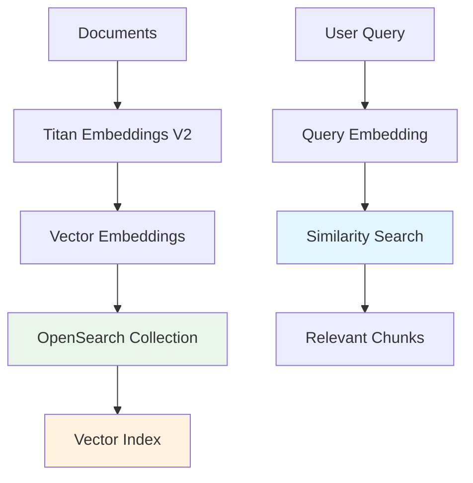

#### OpenSearch Serverless Overview

Amazon OpenSearch Serverless functions as the centralized vector database and memory engine that drives the semantic retrieval capabilities of our Retrieval-Augmented Generation (RAG) workflow. It stores document embeddings and enables high-performance similarity searches for intelligent question answering.

#### What You'll Learn

In this module, you will understand:

- **Vector database architecture** using OpenSearch Serverless
- **Document embedding storage** with Amazon Titan Text Embeddings V2
- **Semantic search capabilities** using k-nearest neighbor algorithms
- **Serverless scaling and cost optimization** benefits

#### OpenSearch Architecture

**1. Vector Storage Flow**

**2. Key Components**

| Component             | Purpose                     | Benefit                          |
| --------------------- | --------------------------- | -------------------------------- |
| **Vector Collection** | Store document embeddings   | Serverless, auto-scaling storage |
| **Vector Index**      | Enable similarity search    | High-performance k-NN algorithms |
| **Metadata Storage**  | Preserve document context   | Traceable retrieval results      |
| **IAM Integration**   | Security and access control | Fine-grained permissions         |

#### How It Works

**1. Document Ingestion**

- Documents processed into high-dimensional vector embeddings
- Amazon Titan Text Embeddings V2 model creates semantic representations
- Supports multiple languages including Vietnamese and English
- Vectors stored in `slack-bedrock-vector-db5` collection

**2. Vector Indexing**

- Embeddings indexed using `slack-bedrock-os-index5`
- k-nearest neighbor (k-NN) algorithms enable similarity search
- Metadata preserved for document traceability
- Sub-second query response times

**3. Query Processing**

- User questions embedded using same Titan V2 model
- Query embedding compared against stored vectors
- Most relevant document chunks retrieved
- Context provided to RAG system for response generation

#### Serverless Benefits

**1. Auto-Scaling**

- Automatically scales with traffic volume
- No manual cluster management required
- Handles varying workloads seamlessly

**2. Cost Optimization**

- Pay-per-use pricing model
- Predictable costs aligned with usage
- No upfront infrastructure investment

**3. Operational Simplicity**

- No node provisioning or maintenance
- Fully managed service
- Built-in high availability

#### Security Features

**1. Access Control**

- IAM-based permissions with `BedrockOSSPolicyForKnowledgeBase`
- Fine-grained access control for authorized components
- Integration with AWS security services

**2. Data Protection**

- Encryption at rest and in transit
- Secure vector storage and retrieval
- Compliance with enterprise security standards

#### Performance Characteristics

- **Response Time**: Sub-second similarity searches
- **Scalability**: Automatic scaling based on demand
- **Accuracy**: Semantic understanding across languages
- **Reliability**: Built-in redundancy and fault tolerance

#### Expected Outcomes

After understanding OpenSearch Serverless architecture:

- ✅ Vector database serves as persistent memory layer
- ✅ Semantic search enables intelligent document retrieval
- ✅ Serverless architecture provides cost-effective scaling
- ✅ Enterprise security ensures data protection

OpenSearch Serverless acts as the intelligent memory of your AI assistant, enabling it to recall and reference organizational knowledge with semantic precision.

---

**Continue to**:

- [5.1 OpenSearch Serverless Collection](../5-opensearch/5.1-collection)
- [5.2 Create Vector Index](../5-opensearch/5.2-vector_index)
