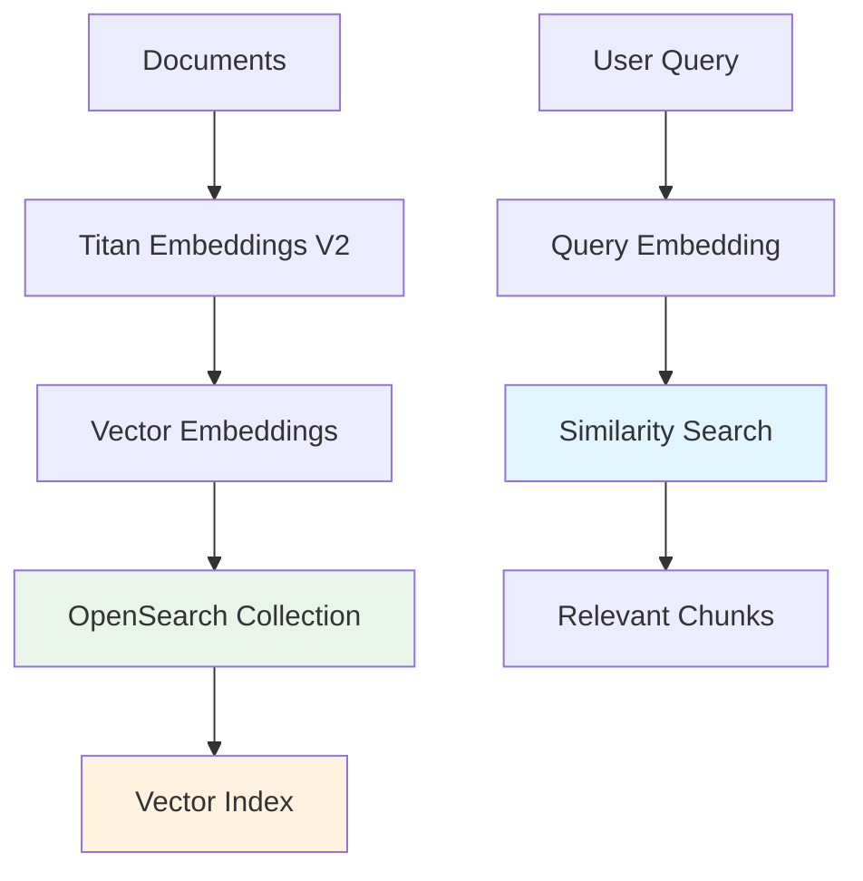

#### Tổng quan OpenSearch Serverless

Amazon OpenSearch Serverless hoạt động như cơ sở dữ liệu vector tập trung và memory engine điều khiển khả năng semantic retrieval của quy trình Retrieval-Augmented Generation (RAG). Nó lưu trữ document embeddings và cho phép tìm kiếm similarity hiệu suất cao để trả lời câu hỏi thông minh.

#### Những gì bạn sẽ học

Trong module này, bạn sẽ hiểu:

- **Kiến trúc vector database** sử dụng OpenSearch Serverless
- **Lưu trữ document embedding** với Amazon Titan Text Embeddings V2
- **Khả năng semantic search** sử dụng thuật toán k-nearest neighbor
- **Lợi ích serverless scaling và tối ưu hóa chi phí**

#### Kiến trúc OpenSearch

**1. Luồng Vector Storage**

**2. Các thành phần chính**

| Thành phần            | Mục đích                    | Lợi ích                          |
| --------------------- | --------------------------- | -------------------------------- |
| **Vector Collection** | Lưu trữ document embeddings | Serverless, auto-scaling storage |
| **Vector Index**      | Cho phép similarity search  | Thuật toán k-NN hiệu suất cao    |
| **Metadata Storage**  | Bảo tồn document context    | Kết quả retrieval có thể truy vết |
| **IAM Integration**   | Bảo mật và kiểm soát truy cập | Quyền chi tiết                   |

#### Cách hoạt động

**1. Document Ingestion**

- Documents được xử lý thành vector embeddings nhiều chiều
- Amazon Titan Text Embeddings V2 model tạo semantic representations
- Hỗ trợ nhiều ngôn ngữ bao gồm tiếng Việt và tiếng Anh
- Vectors được lưu trữ trong collection `slack-bedrock-vector-db5`

**2. Vector Indexing**

- Embeddings được index sử dụng `slack-bedrock-os-index5`
- Thuật toán k-nearest neighbor (k-NN) cho phép similarity search
- Metadata được bảo tồn để truy vết document
- Thời gian phản hồi query dưới một giây

**3. Query Processing**

- Câu hỏi của người dùng được embed sử dụng cùng Titan V2 model
- Query embedding được so sánh với stored vectors
- Document chunks liên quan nhất được retrieve
- Context được cung cấp cho hệ thống RAG để tạo phản hồi

#### Lợi ích Serverless

**1. Auto-Scaling**

- Tự động scale theo traffic volume
- Không cần quản lý cluster thủ công
- Xử lý workloads thay đổi một cách liền mạch

**2. Tối ưu hóa Chi phí**

- Mô hình pricing pay-per-use
- Chi phí có thể dự đoán phù hợp với usage
- Không có đầu tư infrastructure trả trước

**3. Đơn giản Vận hành**

- Không cần provisioning hoặc maintenance node
- Dịch vụ được quản lý hoàn toàn
- High availability tích hợp sẵn

#### Tính năng Bảo mật

**1. Kiểm soát Truy cập**

- Quyền dựa trên IAM với `BedrockOSSPolicyForKnowledgeBase`
- Kiểm soát truy cập chi tiết cho các thành phần được ủy quyền
- Tích hợp với dịch vụ bảo mật AWS

**2. Bảo vệ Dữ liệu**

- Mã hóa at rest và in transit
- Lưu trữ và retrieval vector an toàn
- Tuân thủ tiêu chuẩn bảo mật doanh nghiệp

#### Đặc điểm Hiệu suất

- **Response Time**: Similarity searches dưới một giây
- **Scalability**: Auto scaling dựa trên demand
- **Accuracy**: Hiểu ngữ nghĩa qua các ngôn ngữ
- **Reliability**: Redundancy và fault tolerance tích hợp sẵn

#### Kết quả Mong đợi

Sau khi hiểu kiến trúc OpenSearch Serverless:

- ✅ Vector database phục vụ như persistent memory layer
- ✅ Semantic search cho phép intelligent document retrieval
- ✅ Kiến trúc serverless cung cấp cost-effective scaling
- ✅ Enterprise security đảm bảo data protection

OpenSearch Serverless hoạt động như trí nhớ thông minh của trợ lý AI, cho phép nó nhớ lại và tham chiếu kiến thức tổ chức với độ chính xác ngữ nghĩa.

---

**Tiếp tục đến**:

- [5.1 OpenSearch Serverless Collection](../5-opensearch/5.1-collection)
- [5.2 Tạo Vector Index](../5-opensearch/5.2-vector_index)