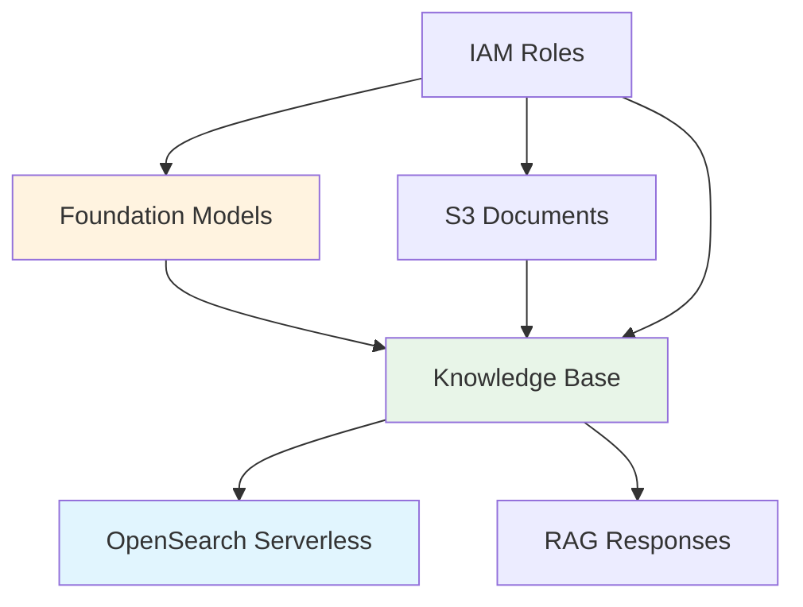

#### Bedrock Setup Overview

Amazon Bedrock serves as the core AI engine for our Slack assistant, providing both the foundation models for text generation and the managed Knowledge Base service for Retrieval-Augmented Generation (RAG). This module covers the essential setup required to enable and configure Bedrock services for your AI assistant.

#### What You'll Learn

In this module, you will understand:

- **Foundation model access** for text generation and embeddings
- **Knowledge Base creation** with RAG capabilities
- **S3 integration** for document storage and processing
- **IAM roles and permissions** for secure Bedrock operations

#### Bedrock Architecture

**1. Core Components**

**2. Key Services**

| Service                 | Purpose                       | Benefit                                     |
| ----------------------- | ----------------------------- | ------------------------------------------- |
| **Claude 3 Sonnet**     | Text generation and reasoning | High-quality natural language responses     |
| **Titan Embeddings V2** | Document vectorization        | Semantic understanding and search           |
| **Knowledge Base**      | RAG orchestration             | Automated retrieval and generation workflow |
| **S3 Integration**      | Document storage              | Scalable, secure document management        |

#### Foundation Models

**1. Claude 3 Sonnet**

- **Purpose**: Primary text generation model
- **Capabilities**: Advanced reasoning, context understanding, multilingual support
- **Use Case**: Generating intelligent responses based on retrieved knowledge

**2. Amazon Titan Text Embeddings V2**

- **Purpose**: Convert text to vector embeddings
- **Dimensions**: 1024-dimensional vectors
- **Languages**: Supports multiple languages including English and Vietnamese
- **Use Case**: Creating searchable vector representations of documents

#### Knowledge Base Service

**1. Managed RAG Workflow**

- **Document Ingestion**: Automatic processing of S3 documents
- **Chunking Strategy**: Intelligent text segmentation for optimal retrieval
- **Vector Storage**: Integration with OpenSearch Serverless
- **Retrieval Logic**: Semantic similarity search with configurable parameters

**2. Benefits**

- **Fully Managed**: No infrastructure management required
- **Auto-Scaling**: Handles varying document volumes and query loads
- **Security**: Built-in encryption and access controls
- **Cost-Effective**: Pay-per-use pricing model

#### Expected Outcomes

After completing this module setup:

- ✅ Foundation models enabled for text generation and embeddings
- ✅ Knowledge Base configured with S3 document source
- ✅ RAG workflow operational for intelligent question answering
- ✅ Secure integration with OpenSearch Serverless established

This setup provides the AI intelligence layer that transforms your Slack bot from a simple interface into a knowledgeable assistant capable of understanding and responding to complex queries about your organizational documents.

---

**Continue to**:

- [6.1 Model Access Setup](./6.1-model_access/)
- [6.2 Set up guardrails](./6.2-guardrails/)
- [6.3 Set up knowledge base](./6.3-knowledge_base/)
