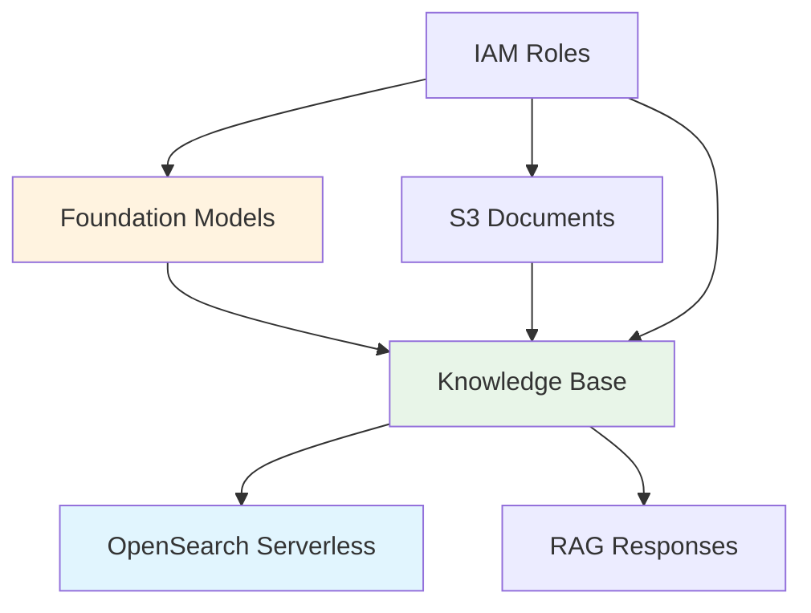

#### Tổng quan Thiết lập Bedrock

Amazon Bedrock đóng vai trò là AI engine cốt lõi cho Slack assistant của chúng ta, cung cấp cả foundation models cho text generation và dịch vụ Knowledge Base được quản lý cho Retrieval-Augmented Generation (RAG). Module này bao gồm thiết lập cần thiết để kích hoạt và cấu hình dịch vụ Bedrock cho trợ lý AI của bạn.

#### Những gì bạn sẽ học

Trong module này, bạn sẽ hiểu:

- **Foundation model access** cho text generation và embeddings
- **Knowledge Base creation** với khả năng RAG
- **S3 integration** cho document storage và processing
- **IAM roles và permissions** cho Bedrock operations an toàn

#### Kiến trúc Bedrock

**1. Các thành phần cốt lõi**

**2. Các dịch vụ chính**

| Dịch vụ                 | Mục đích                     | Lợi ích                                   |
| ----------------------- | ---------------------------- | ----------------------------------------- |
| **Claude 3 Sonnet**     | Text generation và reasoning | Phản hồi ngôn ngữ tự nhiên chất lượng cao |
| **Titan Embeddings V2** | Document vectorization       | Hiểu ngữ nghĩa và tìm kiếm                |
| **Knowledge Base**      | RAG orchestration            | Workflow retrieval và generation tự động  |
| **S3 Integration**      | Document storage             | Quản lý document có thể mở rộng, an toàn  |

#### Foundation Models

**1. Claude 3 Sonnet**

- **Mục đích**: Primary text generation model
- **Khả năng**: Advanced reasoning, context understanding, multilingual support
- **Use Case**: Tạo phản hồi thông minh dựa trên kiến thức được retrieve

**2. Amazon Titan Text Embeddings V2**

- **Mục đích**: Chuyển đổi text thành vector embeddings
- **Dimensions**: 1024-dimensional vectors
- **Languages**: Hỗ trợ nhiều ngôn ngữ bao gồm tiếng Anh và tiếng Việt
- **Use Case**: Tạo vector representations có thể tìm kiếm của documents

#### Knowledge Base Service

**1. Managed RAG Workflow**

- **Document Ingestion**: Xử lý tự động S3 documents
- **Chunking Strategy**: Phân đoạn text thông minh để retrieval tối ưu
- **Vector Storage**: Tích hợp với OpenSearch Serverless
- **Retrieval Logic**: Semantic similarity search với parameters có thể cấu hình

**2. Lợi ích**

- **Fully Managed**: Không cần quản lý infrastructure
- **Auto-Scaling**: Xử lý document volumes và query loads thay đổi
- **Security**: Mã hóa và access controls tích hợp sẵn
- **Cost-Effective**: Mô hình pricing pay-per-use

#### Kết quả Mong đợi

Sau khi hoàn thành thiết lập module này:

- ✅ Foundation models được kích hoạt cho text generation và embeddings
- ✅ Knowledge Base được cấu hình với S3 document source
- ✅ RAG workflow hoạt động cho intelligent question answering
- ✅ Tích hợp an toàn với OpenSearch Serverless được thiết lập

Thiết lập này cung cấp lớp AI intelligence biến đổi Slack bot của bạn từ giao diện đơn giản thành trợ lý có kiến thức có khả năng hiểu và phản hồi các truy vấn phức tạp về documents tổ chức của bạn.

---

**Tiếp tục đến**:

- [6.1 - Thiết lập Model Access](./6.1-model_access/)
- [6.2 Thiết lập guardrails](./6.2-guardrails/)
- [6.3 Thiết lập knowledge base](./6.3-knowledge_base/)
