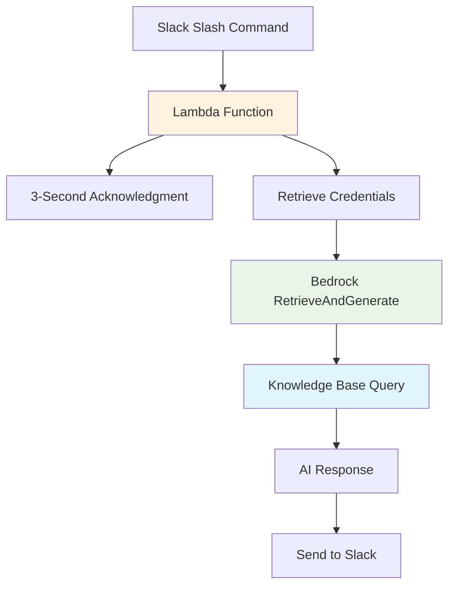

#### Lambda Function Overview

The Lambda function serves as the core orchestrator between Slack and Amazon Bedrock Knowledge Base, handling user queries and delivering intelligent responses. It manages the complete interaction flow from Slack command processing to AI-powered response generation.

#### What You'll Learn

In this module, you will understand:

- **Lambda function architecture** for Slack bot integration
- **Asynchronous processing** with 3-second acknowledgment requirement
- **Bedrock Knowledge Base integration** using RetrieveAndGenerate API
- **Security management** with Secrets Manager and Parameter Store

#### Function Architecture

#### Request Flow

#### Key Components

| Component                | Purpose                        | Timing           |
| ------------------------ | ------------------------------ | ---------------- |
| **Slack Acknowledgment** | Prevent timeout errors         | < 3 seconds      |
| **Credential Retrieval** | Secure access to AWS services  | Initialization   |
| **Bedrock Integration**  | AI-powered response generation | Asynchronous     |
| **Response Delivery**    | Send results back to Slack     | After processing |

#### Core Functionality

**1. Slack Integration**

- **Slash Command Processing**: Handles `/ask-ai` commands from users
- **3-Second Rule**: Acknowledges requests within Slack's timeout limit
- **Asynchronous Response**: Processes queries and responds after acknowledgment

**2. Security Management**

- **AWS Secrets Manager**: Retrieves Slack bot tokens securely
- **Parameter Store**: Accesses configuration values at runtime
- **IAM Integration**: Ensures least privilege access to AWS services

**3. AI Processing**

- **RetrieveAndGenerate API**: Queries Bedrock Knowledge Base
- **Semantic Search**: Finds relevant document chunks
- **Response Generation**: Creates intelligent answers using Claude 3 Sonnet

**4. Configuration Management**

- **Model ID**: Specifies Claude 3 Sonnet for text generation
- **Knowledge Base ID**: References your created Knowledge Base
- **Guardrail Settings**: Ensures safe and appropriate responses

#### Processing Flow

**Phase 1: Request Handling (< 3 seconds)**

1. Receive Slack slash command
2. Validate request signature
3. Send acknowledgment to Slack
4. Queue request for processing

**Phase 2: AI Processing (Asynchronous)**

1. Retrieve credentials from Parameter Store
2. Initialize Bedrock client
3. Call RetrieveAndGenerate API
4. Process Knowledge Base response
5. Send final answer to Slack

#### Expected Outcomes

After implementing the Lambda function:

- ✅ Slack commands processed within timeout limits
- ✅ Secure credential management established
- ✅ AI-powered responses delivered to users
- ✅ Complete integration between Slack and Bedrock

The Lambda function acts as both orchestrator and executor, ensuring seamless interaction between Slack users and your organization's knowledge base through intelligent AI responses.

---

**Continue to**:

- [7.1 Create Lambda Execution Role](./7.1-lambda_role/)
- [7.2 Create and Configure Lambda Function](./7.2-config_code/)
