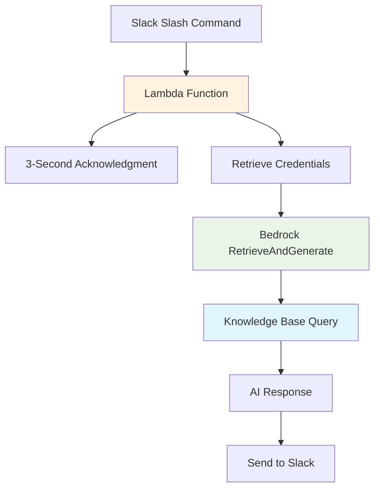

#### Tổng quan Lambda Function

Lambda function đóng vai trò là orchestrator cốt lõi giữa Slack và Amazon Bedrock Knowledge Base, xử lý user queries và cung cấp intelligent responses. Nó quản lý luồng tương tác hoàn chỉnh từ Slack command processing đến AI-powered response generation.

#### Những gì bạn sẽ học

Trong module này, bạn sẽ hiểu:

- **Lambda function architecture** cho Slack bot integration
- **Asynchronous processing** với yêu cầu acknowledgment 3 giây
- **Bedrock Knowledge Base integration** sử dụng RetrieveAndGenerate API
- **Security management** với Secrets Manager và Parameter Store

#### Kiến trúc Function

#### Request Flow

#### Các thành phần chính

| Thành phần               | Mục đích                       | Thời gian       |
| ------------------------ | ------------------------------ | --------------- |
| **Slack Acknowledgment** | Ngăn chặn timeout errors       | < 3 giây        |
| **Credential Retrieval** | Truy cập an toàn AWS services  | Initialization  |
| **Bedrock Integration**  | AI-powered response generation | Asynchronous    |
| **Response Delivery**    | Gửi kết quả trở lại Slack      | Sau processing  |

#### Chức năng Cốt lõi

**1. Slack Integration**

- **Slash Command Processing**: Xử lý lệnh `/ask-ai` từ users
- **3-Second Rule**: Acknowledge requests trong giới hạn timeout của Slack
- **Asynchronous Response**: Xử lý queries và phản hồi sau acknowledgment

**2. Security Management**

- **AWS Secrets Manager**: Retrieve Slack bot tokens một cách an toàn
- **Parameter Store**: Truy cập configuration values tại runtime
- **IAM Integration**: Đảm bảo least privilege access đến AWS services

**3. AI Processing**

- **RetrieveAndGenerate API**: Query Bedrock Knowledge Base
- **Semantic Search**: Tìm relevant document chunks
- **Response Generation**: Tạo intelligent answers sử dụng Claude 3 Sonnet

**4. Configuration Management**

- **Model ID**: Chỉ định Claude 3 Sonnet cho text generation
- **Knowledge Base ID**: Tham chiếu Knowledge Base đã tạo của bạn
- **Guardrail Settings**: Đảm bảo safe và appropriate responses

#### Processing Flow

**Phase 1: Request Handling (< 3 giây)**

1. Nhận Slack slash command
2. Validate request signature
3. Gửi acknowledgment đến Slack
4. Queue request để processing

**Phase 2: AI Processing (Asynchronous)**

1. Retrieve credentials từ Parameter Store
2. Initialize Bedrock client
3. Gọi RetrieveAndGenerate API
4. Xử lý Knowledge Base response
5. Gửi final answer đến Slack

#### Kết quả Mong đợi

Sau khi triển khai Lambda function:

- ✅ Slack commands được xử lý trong giới hạn timeout
- ✅ Secure credential management được thiết lập
- ✅ AI-powered responses được cung cấp cho users
- ✅ Tích hợp hoàn chỉnh giữa Slack và Bedrock

Lambda function hoạt động như cả orchestrator và executor, đảm bảo tương tác liền mạch giữa Slack users và knowledge base tổ chức của bạn thông qua intelligent AI responses.

---

**Tiếp tục đến**:

- [7.1 Tạo Lambda Execution Role](./7.1-lambda_role/)
- [7.2 Tạo và Cấu hình Lambda Function](./7.2-config_code/)