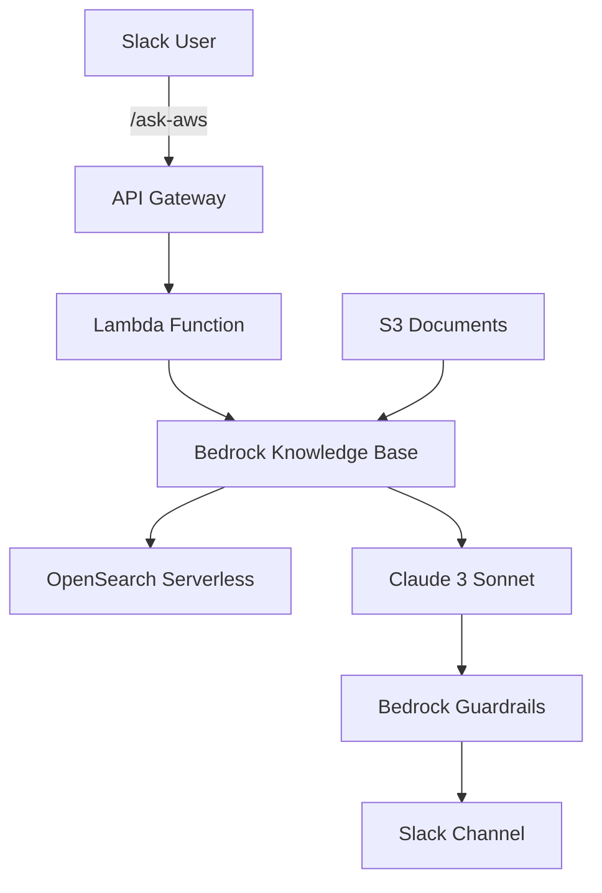

# Build a Slack AI Bot with Amazon Bedrock Knowledge Bases

[](https://aws.amazon.com/bedrock/)
[](https://www.python.org/)
[](https://slack.dev/)

## 🎯 Workshop Overview

Learn to build an intelligent Slack bot using Amazon Bedrock Knowledge Bases to answer questions from your organization's documents.

**What you'll build:**
- Slack bot responding to `/ask-aws` commands
- RAG system with Amazon Bedrock
- Enterprise security with Guardrails
- Scalable serverless architecture

## 🏗️ Architecture



## 📋 Prerequisites

### Required Knowledge
- Basic AWS (Lambda, S3, IAM)
- Basic Python
- REST API
- Basic AI/ML

### Required Tools
- **AWS Account** with Bedrock access
- **Slack Workspace** with admin permissions
- **Python 3.12+**
- **AWS CLI** configured

### AWS Services Used
- Amazon Bedrock
- AWS Lambda
- API Gateway
- Amazon S3
- OpenSearch Serverless
- AWS Secrets Manager
- CloudWatch

## ⏱️ Workshop Timeline

| Module | Duration | Content |
|--------|----------|---------|
| 1 | 15 min | Introduction |
| 2 | 30 min | Environment Setup |
| 3 | 45 min | Slack App Configuration |
| 4 | 30 min | Security Setup |
| 5 | 45 min | OpenSearch Serverless |
| 6 | 30 min | Bedrock Knowledge Base |
| 7 | 45 min | Lambda Implementation |
| 8 | 20 min | API Gateway & Testing |
| 9 | 15 min | Resource Cleanup |
| 10 | 15 min | Conclusion |

**Total Duration:** 4-5 hours

## 🚀 Quick Start

### 1. Enable Bedrock Models
```bash
# Access Amazon Bedrock Console
# Enable: Amazon Titan Text Embeddings V2
# Enable: Anthropic Claude 3 Sonnet
```

### 2. Create Slack App
```bash
# Visit https://api.slack.com/apps
# Create new app "From scratch"
# Add OAuth scopes: commands, chat:write
# Install to workspace
```

### 3. Follow Modules
Start with [Module 1](content/1-introduction/)

## 📁 Workshop Structure

```
Bedrock-Slackbot-AI-Workshop/
├── content/
│   ├── 1-introduction/
│   ├── 2-environment-setup/
│   ├── 3-slack_app/
│   ├── 4-security/
│   ├── 5-opensearch/
│   ├── 6-bedrock_setup/
│   ├── 7-lambda_implementation/
│   ├── 8-api_gateway/
│   ├── 9-clear_resources/
│   └── 10-conclusion/
├── images/
└── README.md
```

## ✨ Key Features

### 🤖 Intelligent Slack Bot
- Natural language processing
- Contextual responses with source citations
- Fast response under 3 seconds

### 🛡️ Enterprise Security
- Content filtering with Bedrock Guardrails
- PII protection
- IAM access control
- Secure credential management

### 📊 Production Ready
- CloudWatch monitoring
- Graceful error handling
- Auto-scaling serverless architecture
- Cost optimization

### 🔍 Advanced RAG
- Semantic search with vectors
- Multi-document support
- Source citation tracking
- Real-time updates

## 💰 Cost Estimation

**Workshop completion cost:** ~$5-10

| Service | Usage | Cost |
|---------|-------|------|
| Lambda | 1,000 requests | $0.20 |
| API Gateway | 1,000 requests | $3.50 |
| Bedrock | 100K tokens | $3.00 |
| OpenSearch | 1 OCU × 4h | $0.96 |
| S3 | 10GB | $0.23 |

**Production monthly cost:** ~$175 (100 users, 1000 queries)

## 🎓 What You'll Learn

- **AWS Infrastructure Deployment** with proper security
- **AI/ML Integration** with Amazon Bedrock
- **Serverless Development** with Lambda
- **Operations & Monitoring** with CloudWatch

## 📚 Additional Resources

### Documentation
- [Amazon Bedrock User Guide](https://docs.aws.amazon.com/bedrock/)
- [Slack Bolt for Python](https://slack.dev/bolt-python/)
- [OpenSearch Serverless Guide](https://docs.aws.amazon.com/opensearch-service/latest/developerguide/serverless.html)

### Sample Use Cases
- **Customer Support**: Answer from product documentation
- **HR Assistant**: Query company policies
- **Technical Documentation**: Search knowledge base
- **Compliance**: Access regulatory information

## 🤝 Contributing

We welcome all contributions!

### How to Contribute
- 🐛 Report bugs
- 💡 Suggest new features
- 📝 Improve documentation
- 🧪 Add test cases

## 🆘 Support

### Get Help
- 📖 Check workshop modules
- 🎫 Open [Issue](https://github.com/your-repo/issues)
- 📧 Contact workshop team

### Common Issues
- **Bedrock Model Access**: Ensure models are enabled in region
- **Slack Permissions**: Check OAuth scopes
- **API Limits**: Check service quotas
- **Cost Management**: Monitor usage and set alerts

## 🔄 Version

### v1.0.0 - Current
- ✨ First workshop release
- 🤖 Support for Claude 3 Sonnet and Titan Embeddings V2
- 🛡️ Bedrock Guardrails integration
- 📊 Comprehensive security setup

### Upcoming Features
- 🌐 Multi-language support
- 🔄 Automated CI/CD pipeline
- 📱 Mobile-optimized Slack interface
- 🎯 Advanced analytics dashboard

---

**Ready to build your AI Slack assistant?** 🚀

[**Start Workshop →**](https://ai-assistant-chatbot.github.io/Bedrock-Slackbot-AI-Workshop/Generative-AI-Slack-Assistant-with-Amazon-Bedrock-Knowledge-Bases/)

---