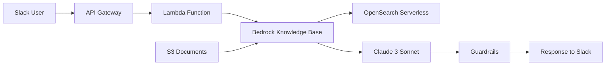

# Build a Generative AI Slack Assistant with Amazon Bedrock Knowledge Bases

[](https://aws.amazon.com/bedrock/)
[](https://www.python.org/)
[](https://slack.dev/)
[](LICENSE)

## 🚀 Workshop Overview

Learn to build a production-ready Slack bot powered by Amazon Bedrock Knowledge Bases that can answer questions about your organization's documents using advanced AI and natural language processing.

**What you'll build:**
- A Slack bot that responds to `/ask-aws` commands
- RAG (Retrieval-Augmented Generation) system using Amazon Bedrock
- Enterprise-grade security with content filtering
- Scalable serverless architecture on AWS

## 🎯 Learning Objectives

By the end of this workshop, you will:

- ✅ **Build a production-ready Slack bot** with generative AI capabilities
- ✅ **Implement RAG architecture** using Amazon Bedrock Knowledge Bases
- ✅ **Configure enterprise security** with Bedrock Guardrails and content filtering
- ✅ **Deploy serverless infrastructure** using AWS Lambda, API Gateway, and OpenSearch
- ✅ **Monitor and optimize** your AI application for production use

## 🏗️ Architecture



**Key Components:**
- **Slack Interface**: Natural language interaction via slash commands
- **API Gateway**: RESTful API endpoint for Slack webhooks
- **AWS Lambda**: Serverless compute for bot logic
- **Amazon Bedrock**: Fully managed AI service with Knowledge Bases
- **OpenSearch Serverless**: Vector database for semantic search
- **S3**: Document storage for knowledge base content

## 📋 Prerequisites

### Required Knowledge
- Basic AWS services (Lambda, S3, IAM)
- Python programming fundamentals
- REST API concepts
- Basic understanding of AI/ML concepts

### Required Tools
- **AWS Account** with appropriate permissions
- **Slack Workspace** with admin access
- **Python 3.12+** installed locally
- **AWS CLI** configured
- **Code Editor** (VS Code recommended)

### AWS Services Used
- Amazon Bedrock (Knowledge Bases, Guardrails)
- AWS Lambda
- Amazon API Gateway
- Amazon S3
- Amazon OpenSearch Serverless
- AWS Secrets Manager
- Amazon CloudWatch

## ⏱️ Workshop Timeline

| Module | Duration | Topic |
|--------|----------|-------|
| **0** | 15 min | Workshop Introduction |
| **1** | 30 min | Environment Setup |
| **2** | 45 min | Knowledge Base Foundation |
| **3** | 30 min | Amazon Bedrock Knowledge Base |
| **4** | 45 min | Slack Bot Development |
| **5** | 20 min | API Gateway Integration |
| **6** | 15 min | Slack Configuration |
| **7** | 30 min | Advanced Features |
| **8** | 25 min | Monitoring & Operations |
| **9** | 20 min | Testing & Validation |
| **10** | 15 min | Cleanup & Next Steps |

**Total Duration:** 3-4 hours

## 🛠️ Quick Start

### 1. Clone the Repository
```bash
git clone https://github.com/aws-samples/bedrock-slack-bot-workshop.git
cd bedrock-slack-bot-workshop
```

### 2. Set Up Environment
```bash
# Create virtual environment
python -m venv venv
source venv/bin/activate  # Linux/Mac
# venv\Scripts\activate   # Windows

# Install dependencies
pip install -r requirements.txt
```

### 3. Configure AWS CLI
```bash
aws configure
# Enter your AWS Access Key ID, Secret Access Key, and region (us-east-1)
```

### 4. Enable Bedrock Models
1. Go to [Amazon Bedrock Console](https://console.aws.amazon.com/bedrock/)
2. Navigate to "Model access"
3. Enable:
   - Amazon Titan Text Embeddings V2
   - Anthropic Claude 3 Sonnet

### 5. Create Slack App
1. Visit [Slack API](https://api.slack.com/apps)
2. Create new app "From scratch"
3. Add OAuth scopes: `calls:write`, `commands`, `incoming-webhook`
4. Install to your workspace

## 📁 Repository Structure

```
bedrock-slack-bot-workshop/
├── modules/                    # Workshop modules
│   ├── module-01-setup/
│   ├── module-02-knowledge-base/
│   ├── module-03-bedrock/
│   └── ...
├── src/                       # Source code
│   ├── lambda/
│   │   ├── slack_bot.py      # Main bot logic
│   │   └── requirements.txt
│   └── templates/
│       └── cloudformation.yaml
├── docs/                      # Documentation
│   ├── architecture.md
│   └── troubleshooting.md
├── sample-data/              # Sample documents
│   ├── well-architected-framework.pdf
│   └── security-pillar.pdf
└── README.md
```

## 🔧 Key Features

### 🤖 Intelligent Slack Bot
- **Natural Language Processing**: Ask questions in plain English
- **Contextual Responses**: AI-powered answers with source citations
- **Instant Feedback**: Sub-3-second acknowledgment with async processing

### 🛡️ Enterprise Security
- **Content Filtering**: Bedrock Guardrails block inappropriate content
- **PII Protection**: Automatic detection and anonymization
- **Access Control**: IAM-based permissions and Slack workspace restrictions

### 📊 Production Ready
- **Monitoring**: CloudWatch logs and custom metrics
- **Error Handling**: Graceful degradation and user-friendly messages
- **Scalability**: Serverless architecture with auto-scaling
- **Cost Optimization**: Pay-per-use pricing model

### 🔍 Advanced RAG
- **Semantic Search**: Vector-based document retrieval
- **Multi-Document Support**: Query across multiple knowledge sources
- **Citation Tracking**: Source attribution for all responses
- **Real-time Updates**: Dynamic knowledge base synchronization

## 💰 Cost Estimation

**Workshop Completion Cost:** ~$5-10

| Service | Usage | Cost |
|---------|-------|------|
| Lambda | 1,000 requests | $0.20 |
| API Gateway | 1,000 requests | $3.50 |
| Bedrock | 100K tokens | $3.00 |
| OpenSearch Serverless | 1 OCU × 4 hours | $0.96 |
| S3 | 10GB storage | $0.23 |

**Production Monthly Cost:** ~$175 (100 users, 1000 queries)

## 🎓 What You'll Learn

### Module Highlights

**🏗️ Infrastructure as Code**
- Deploy AWS resources using CloudFormation/CDK
- Configure OpenSearch Serverless for vector search
- Set up secure IAM roles and policies

**🤖 AI/ML Integration**
- Implement RAG architecture with Amazon Bedrock
- Configure foundation models (Claude 3, Titan Embeddings)
- Apply content safety with Guardrails

**⚡ Serverless Development**
- Build event-driven Lambda functions
- Integrate with Slack using Bolt framework
- Handle async processing and error management

**📊 Operations & Monitoring**
- Set up CloudWatch logging and metrics
- Configure alerts and troubleshooting
- Implement performance optimization

## 🚦 Getting Started

### Option 1: Self-Paced Learning
Follow the [Workshop Guide](docs/workshop-guide.md) at your own pace.

### Option 2: Instructor-Led Workshop
Join our live workshops at AWS events and summits.

### Option 3: AWS Workshop Studio
Access the interactive version on [AWS Workshop Studio](https://catalog.workshops.aws/).

## 📚 Additional Resources

### Documentation
- [Amazon Bedrock User Guide](https://docs.aws.amazon.com/bedrock/)
- [Slack Bolt for Python](https://slack.dev/bolt-python/)
- [OpenSearch Serverless Guide](https://docs.aws.amazon.com/opensearch-service/latest/developerguide/serverless.html)

### Sample Use Cases
- **Customer Support**: Answer product questions from documentation
- **HR Assistant**: Query company policies and procedures
- **Technical Documentation**: Search engineering knowledge base
- **Compliance**: Access regulatory and compliance information

### Related Workshops
- [Build with Amazon Bedrock](https://catalog.workshops.aws/bedrock-immersion-day/)
- [Serverless AI Applications](https://catalog.workshops.aws/serverless-ai/)
- [OpenSearch Workshop](https://catalog.workshops.aws/opensearch/)

## 🤝 Contributing

We welcome contributions! Please see our [Contributing Guide](CONTRIBUTING.md) for details.

### Ways to Contribute
- 🐛 Report bugs and issues
- 💡 Suggest new features or improvements
- 📝 Improve documentation
- 🧪 Add test cases
- 🌟 Share your use cases and success stories

## 📄 License

This project is licensed under the MIT-0 License. See the [LICENSE](LICENSE) file for details.

## 🆘 Support

### Getting Help
- 📖 Check the [Troubleshooting Guide](docs/troubleshooting.md)
- 💬 Join our [Slack Community](https://join.slack.com/t/aws-bedrock-community)
- 🎫 Open an [Issue](https://github.com/aws-samples/bedrock-slack-bot-workshop/issues)
- 📧 Contact the workshop team

### Common Issues
- **Bedrock Model Access**: Ensure models are enabled in your region
- **Slack Permissions**: Verify OAuth scopes and workspace installation
- **API Limits**: Check service quotas and rate limits
- **Cost Management**: Monitor usage and set up billing alerts

## 🏆 Success Stories

> *"This workshop helped us build an internal knowledge assistant that reduced support tickets by 40% and improved employee productivity."*  
> — **Enterprise Customer**

> *"The step-by-step approach made it easy to understand RAG architecture and implement it in our organization."*  
> — **Solutions Architect**

> *"Great hands-on experience with Amazon Bedrock. The security features are exactly what we needed for enterprise deployment."*  
> — **DevOps Engineer**

## 🔄 Updates & Changelog

### Latest Version: v1.0.0
- ✨ Initial workshop release
- 🤖 Support for Claude 3 Sonnet and Titan Embeddings V2
- 🛡️ Bedrock Guardrails integration
- 📊 Comprehensive monitoring setup

### Upcoming Features
- 🌐 Multi-language support
- 🔄 Automated CI/CD pipeline
- 📱 Mobile-optimized Slack interface
- 🎯 Advanced analytics dashboard

---

**Ready to build your AI-powered Slack assistant?** 🚀

[**Start the Workshop →**](docs/workshop-guide.md)

---

<div align="center">

**Built with ❤️ by the AWS Community**

[🌟 Star this repo](https://github.com/aws-samples/bedrock-slack-bot-workshop) | [🍴 Fork it](https://github.com/aws-samples/bedrock-slack-bot-workshop/fork) | [📢 Share it](https://twitter.com/intent/tweet?text=Check%20out%20this%20awesome%20AWS%20Bedrock%20Slack%20Bot%20workshop!)

</div>